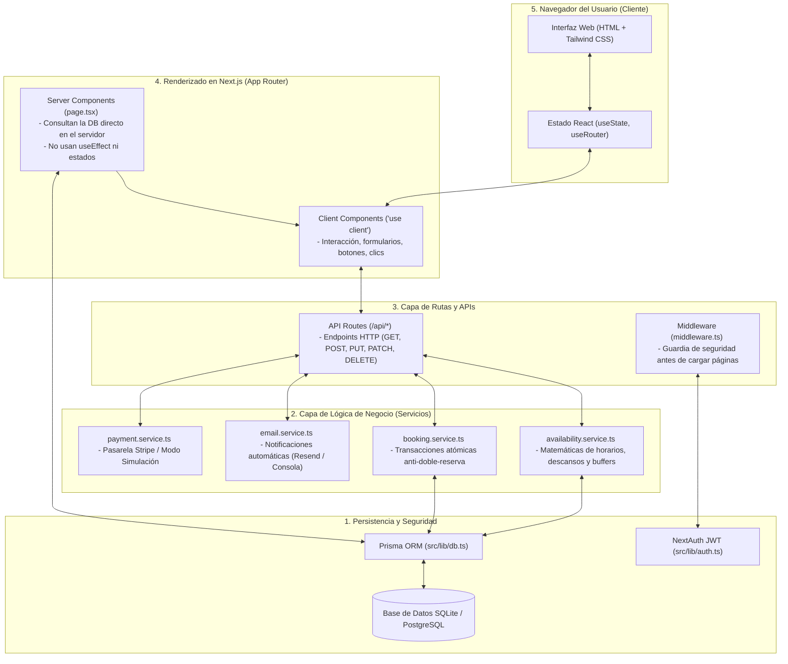
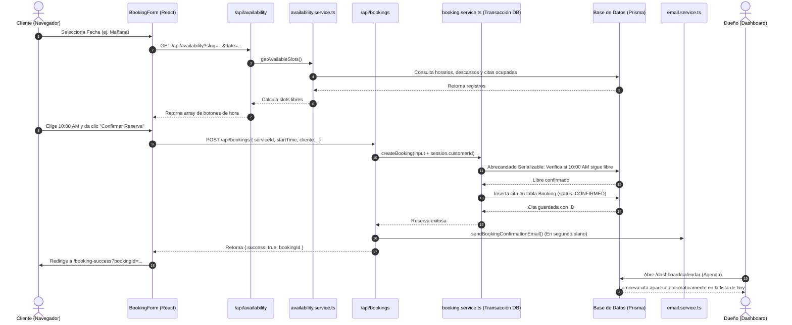

# Guía Maestra de Arquitectura, Conexiones y Dependencias de Deto SaaS

Este documento es el mapa anatómico de **Deto SaaS**. Explica **qué hace cada pieza del sistema**, **de qué conexión o dato depende para funcionar**, y **cómo se comunican los componentes entre sí** para garantizar que la lógica de negocio nunca se rompa.

---

## 1. Mapa Global de Conexiones (La Tubería del Sistema)

Para entender cómo funciona Deto, imagina una tubería de 5 capas donde la información viaja en dos direcciones:



### Las 4 Fuentes de Verdad de las que depende Deto:
1. **La Base de Datos (Prisma):** Donde viven los negocios, servicios, horarios, citas y usuarios. Si algo no está aquí, no existe.
2. **El Token de Sesión (JWT NextAuth):** Una cookie encriptada en el navegador que responde a la pregunta *"¿Quién eres y qué rol tienes?"* (`userId`, `role`, `businessSlug`).
3. **El Entorno (`.env`):** Las llaves maestras (`DATABASE_URL`, `NEXTAUTH_SECRET`, `RESEND_API_KEY`, `STRIPE_SECRET_KEY`).
4. **La URL (Rutas y Parámetros):** Parámetros dinámicos que definen el contexto, como `slug` en `/b/[slug]`, `serviceId` en `/book/[serviceId]`, o `callbackUrl` en el login.

---

## 2. Anatomía Archivo por Archivo: Qué Hace y De Qué Depende

---

### A. Autenticación, Sesión y Seguridad

#### 1. [`src/lib/auth.ts`](file:///home/daniel/dev/deto/src/lib/auth.ts) — El Notario del Sistema
* **Qué hace:** Configura NextAuth con `CredentialsProvider`. Recibe email y contraseña, busca al usuario en la base de datos, compara el hash con `bcryptjs`, y emite un token JWT con la información de la sesión.
* **De qué conexiones depende:**
  1. Conexión a la tabla `User` (campo `email` y `passwordHash`).
  2. Conexión relacional con la tabla `Business`: Si el usuario es dueño (`BUSINESS_OWNER`), busca su primer negocio e inyecta `businessId` y `businessSlug` en el JWT.
* **A quién alimenta:**
  - Al hook de React `useSession()` en el cliente.
  - A la función del servidor `getServerSession(authOptions)` en Server Components y APIs.
* **Qué pasa si falla la conexión:** Si el usuario no existe o la contraseña no coincide, devuelve `null` y el login arroja error. Si un `BUSINESS_OWNER` no tiene negocio creado en la DB, `businessSlug` será `null` y el header no mostrará el botón de "Ver mi negocio".

#### 2. [`src/middleware.ts`](file:///home/daniel/dev/deto/src/middleware.ts) — El Guardia de Seguridad en la Puerta
* **Qué hace:** Se ejecuta en el borde (*Edge*) antes de que cualquier página privada cargue. Protege las rutas `/dashboard/*` y `/mis-citas/*`.
* **De qué conexiones depende:**
  - Del token JWT desencriptado (`req.nextauth.token`).
* **Reglas de decisión:**
  - Si intentas entrar a `/dashboard` y `token.role !== "BUSINESS_OWNER"`, te redirige de inmediato a `/explorar` (los clientes no pueden ver la administración de negocios).
  - Si intentas entrar a `/mis-citas` sin sesión, te redirige a `/login?callbackUrl=/mis-citas`.
* **Qué pasa si falla:** Si se retira el middleware, cualquier usuario no autenticado podría abrir las URLs privadas (aunque las páginas darían error al no encontrar datos de sesión).

---

### B. Capa de Lógica de Negocio (`src/services/`)

Aquí vive la inteligencia pura de Deto, desacoplada de la interfaz visual.

#### 1. [`src/services/availability.service.ts`](file:///home/daniel/dev/deto/src/services/availability.service.ts) — El Motor de Horarios y Disponibilidad
* **Qué hace:** Es el algoritmo matemático que calcula exactamente qué botones de horario aparecen en pantalla cuando un cliente elige una fecha.
* **De qué conexiones depende para calcular un día:**
  ```
  1. BusinessSchedule: ¿El negocio abre ese día de la semana (0=Dom, 1=Lun...)? 
     └─ Si isClosed === true -> Devuelve 0 slots libres.
  2. StaffSchedule: ¿A qué hora entra y sale el especialista y cuándo almuerza (breakStart/breakEnd)?
  3. Service: ¿Cuántos minutos dura el servicio (durationMinutes) y cuánto buffer de descanso necesita (bufferMinutes)?
  4. Booking: ¿Qué citas activas existen ya para ese especialista en esa fecha?
     └─ Solo bloquea si status es 'CONFIRMED', 'COMPLETED' o 'PENDING' con expiresAt vigente en el futuro.
  ```
* **Fórmula de cálculo:**
  $$\text{Intervalo Ocupado} = \text{Duración del Servicio} + \text{Buffer Posterior}$$
* **Qué pasa si falla:** Si el negocio no tiene configurado el horario de ese día, el motor previene errores y devuelve una lista vacía de slots con el mensaje *"No hay horarios disponibles para esta fecha"*.

#### 2. [`src/services/booking.service.ts`](file:///home/daniel/dev/deto/src/services/booking.service.ts) — El Garante de Transacciones Atómicas
* **Qué hace:** Crea citas de forma segura impidiendo que dos personas reserven el mismo turno al mismo milisegundo (condición de carrera).
* **De qué conexiones depende:**
  - De una transacción de base de datos con nivel de aislamiento `Serializable` (`prisma.$transaction`).
* **Lógica interna:**
  1. Vuelve a verificar dentro del candado de la transacción si el slot sigue libre.
  2. Si alguien se adelantó, aborta la transacción y devuelve `SLOT_OCCUPIED`.
  3. Si está libre, inserta la cita con status `CONFIRMED` (si es pago en local) o `PENDING` con `expiresAt` a 15 minutos (si es Stripe).
  4. Vincula `customerId` si el usuario estaba logueado.
* **Qué pasa si falla:** La transacción se revierte al 100% (*rollback*), impidiendo citas corruptas o a medias.

#### 3. [`src/services/email.service.ts`](file:///home/daniel/dev/deto/src/services/email.service.ts) — El Sistema de Notificaciones
* **Qué hace:** Envía el correo electrónico de confirmación con fecha, hora, especialista, folio y enlace al portal, así como el correo de cancelación.
* **De qué conexiones depende:**
  - De la variable de entorno `RESEND_API_KEY`.
* **Mecanismo de Resiliencia:** Si la clave API de Resend no está configurada o es de prueba, el servicio **no se rompe**: imprime un ticket formateado en la consola del servidor simulando el correo y retorna `true`. Esto permite desarrollar y probar localmente sin depender de un proveedor de emails activo.

#### 4. [`src/services/payment.service.ts`](file:///home/daniel/dev/deto/src/services/payment.service.ts) — La Pasarela de Pagos
* **Qué hace:** Crea sesiones de Stripe Checkout o ejecuta el modo de simulación.
* **De qué conexiones depende:**
  - De `STRIPE_SECRET_KEY`. Si detecta claves mock (`sk_test_mock...`), procesa la reserva en **Modo Simulación / Demo** confirmando la cita al instante con una etiqueta visible para que el usuario pueda probar el flujo completo sin errores.

---

### C. Componentes de la Interfaz y Vistas (`src/app/` y `src/components/`)

#### 1. [`src/components/header.tsx`](file:///home/daniel/dev/deto/src/components/header.tsx) — La Barra de Navegación Contextual
* **Qué hace:** Muestra un menú completamente distinto según **dónde estás** y **quién eres**.
* **De qué conexiones depende:**
  - Del hook `usePathname()` para saber si la ruta actual es `/` (Landing) u otra.
  - De la prop `user` que le inyecta el `layout.tsx` desde el servidor.
  - De la prop `upcomingBookings` (para pintar el badge verde con el contador de citas próximas del cliente).
* **Matriz de visualización:**
  | Estado | Dónde está | Qué muestra |
  |---|---|---|
  | Sin sesión | En `/` (Landing) | Anclas: "Cómo funciona", "Precios", botón "Iniciar Sesión" y "Registrar Negocio". |
  | Sin sesión | Fuera de `/` | Enlace: "← Catálogo de Negocios", "Iniciar Sesión", "Registrarse" y "Crear Negocio". |
  | Rol `CLIENT` | Cualquier ruta | "Explorar Negocios", Badge de Citas Próximas, "Mis Citas", nombre del cliente y botón "Cerrar Sesión". Oculta opciones de administración. |
  | Rol `BUSINESS_OWNER` | Cualquier ruta | "Resumen", "Agenda", "Servicios", botón "Ver mi negocio ↗", nombre del dueño y "Cerrar Sesión". Oculta opciones de cliente. |

#### 2. [`src/app/page.tsx`](file:///home/daniel/dev/deto/src/app/page.tsx) — Landing Page Promocional
* **Qué hace:** Vende el SaaS a los dueños de negocios para que se registren.
* **Por qué está estructurada así:**
  - El botón principal es un CTA que envía a `/explorar` (catálogo) para que los visitantes prueben el producto.
  - El botón secundario es para registrar comercios (`/register`).
  - No hace consultas pesadas a la base de datos para que cargue de forma instantánea.

#### 3. [`src/app/explorar/page.tsx`](file:///home/daniel/dev/deto/src/app/explorar/page.tsx) y [`explorar-view.tsx`](file:///home/daniel/dev/deto/src/app/explorar/explorar-view.tsx) — El Catálogo Público
* **Qué hace:** Lista todos los negocios disponibles en una cuadrícula con buscador en tiempo real.
* **De qué conexiones depende:**
  - El archivo `page.tsx` (Server Component) consulta a Prisma:
    `prisma.business.findMany({ include: { services: { where: { isActive: true } } } })`
  - Le pasa los comercios a `explorar-view.tsx` (Client Component), que gestiona el filtro de texto y los botones rápidos (*Barbería, Corte, Miraflores*).
* **Conexión con el siguiente paso:** Cada tarjeta tiene un botón que lleva a `/b/[slug]`, donde `[slug]` es el identificador único del negocio (ej. `barberia-deto`).

#### 4. [`src/app/b/[slug]/page.tsx`](file:///home/daniel/dev/deto/src/app/b/[slug]/page.tsx) — El Perfil Público del Negocio
* **Qué hace:** Es la carta de presentación del negocio: muestra su dirección, teléfono, servicios activos con precios en Soles y tabla semanal de horarios.
* **De qué conexiones depende:**
  - Del parámetro `params.slug` de la URL. Busca en la DB con `where: { slug }`. Si alguien escribe una URL con un slug inexistente, ejecuta `notFound()` mostrando un 404 limpio.
* **Conexión con la reserva:** Cada servicio tiene un botón que lleva a `/b/[slug]/book/[serviceId]`.

#### 5. [`src/app/b/[slug]/book/[serviceId]/booking-form.tsx`](file:///home/daniel/dev/deto/src/app/b/[slug]/book/[serviceId]/booking-form.tsx) — El Corazón del Agendamiento
* **Qué hace:** Gestiona todo el proceso de agendamiento en 4 pasos ordenados.
* **De qué conexiones depende:**
  1. **Conexión con la sesión (`sessionUser`):**
     - Si `sessionUser === null`: Muestra el **Gate de Autenticación** ("Inicia sesión o regístrate para reservar"). Los botones envían a `/login?callbackUrl=...` para que, tras iniciar sesión, el cliente regrese exactamente a este punto sin perder el contexto.
     - Si `sessionUser !== null`: Autocompleta el nombre, correo y teléfono en el formulario, manteniéndolos editables.
  2. **Conexión con la API de disponibilidad:**
     - Al cambiar la fecha en el calendario, dispara un `fetch('/api/availability?slug=...&serviceId=...&date=...')` para obtener los slots en vivo.
  3. **Conexión con la API de creación:**
     - Al dar clic en "Confirmar Reserva", envía los datos por `fetch('/api/bookings')`. Como la API lee la sesión en el servidor, asocia la cita al `customerId` del usuario.

#### 6. [`src/app/mis-citas/page.tsx`](file:///home/daniel/dev/deto/src/app/mis-citas/page.tsx) y [`client-bookings-view.tsx`](file:///home/daniel/dev/deto/src/app/mis-citas/client-bookings-view.tsx) — El Portal del Cliente
* **Qué hace:** Muestra al cliente sus citas separadas en dos listas:
  - **Próximas Citas:** Citas futuras con botón de "Cancelar Cita".
  - **Historial Pasado:** Citas completadas o canceladas en formato de tabla para consulta histórica.
* **De qué conexiones depende:**
  - Depende directamente de `session.user.id`. Consulta a Prisma:
    `where: { customerId: user.id }`
  - **No usa localStorage ni correos en query params:** Toda la información proviene del usuario autenticado en la sesión, garantizando privacidad total.
* **Conexión al cancelar:** Llama a `POST /api/client/bookings/[id]/cancel`. La API comprueba que la cita realmente pertenezca a ese usuario antes de cancelarla y dispara el correo de cancelación mediante `email.service.ts`.

#### 7. [`src/app/dashboard/*`](file:///home/daniel/dev/deto/src/app/dashboard/page.tsx) — El Centro de Mando del Negocio
* **Qué hace:** Permite al dueño del negocio operar su día a día.
* **Rutas internas y de qué dependen:**
  - `/dashboard` (Resumen): Depende de `prisma.booking.count` para contar las citas de hoy e ingresos proyectados.
  - `/dashboard/calendar` (Agenda): Lista citas y permite cambiar estados con botones de acción rápida (`PATCH /api/bookings/[id]/status`). Usa `router.refresh()` para que la pantalla se sincronice al instante sin recargar el navegador.
  - `/dashboard/services` (Servicios): Permite crear, editar precios/duración, pausar y eliminar servicios.
  - **Regla de Integridad de Datos:** En [`src/app/api/services/[id]/route.ts`](file:///home/daniel/dev/deto/src/app/api/services/[id]/route.ts), si intentas eliminar un servicio que ya tiene citas registradas en el historial, la base de datos no lo borra físicamente (lo cual rompería las citas pasadas); en su lugar, lo desactiva (`isActive: false`) protegiendo los datos contables.

---

## 3. Matriz de Causa y Efecto: "Si toco X, qué pasa con Y"

Esta tabla te indica qué consecuencias tiene alterar una tabla, campo o archivo:

| Si modificas este dato o archivo... | Afecta directamente a... | Por qué ocurre esa conexión... |
|---|---|---|
| `Service.durationMinutes` o `bufferMinutes` | La cuadrícula de horarios en el agendamiento | `availability.service.ts` suma ambos valores para calcular a qué hora puede empezar la siguiente cita. |
| `Service.isActive = false` | El catálogo de `/b/[slug]` y la API de slots | Las consultas tienen la condición `where: { isActive: true }`. El servicio desaparece para los clientes pero sigue existiendo en el panel del dueño. |
| `BusinessSchedule.isClosed = true` | La disponibilidad de ese día de la semana | El motor descarta automáticamente cualquier turno en días marcados como cerrados. |
| `Booking.status` | El calendario del dashboard y `/mis-citas` | Los componentes filtran por `status in ["CONFIRMED", "COMPLETED"]` para turnos activos y `"CANCELLED"` para turnos liberados. |
| `Booking.customerId` | La pantalla `/mis-citas` del cliente | La página busca citas donde `customerId === session.user.id`. Si este campo queda vacío (cita anónima), el cliente nunca la verá en su lista. |
| `User.role` | El Header, el Middleware y el Login | `middleware.ts` y `header.tsx` bifurcan toda la experiencia basándose en si el rol es `BUSINESS_OWNER` o `CLIENT`. |
| `Business.slug` | Todas las URLs públicas `/b/[slug]` | Las páginas buscan el negocio mediante `where: { slug }`. Si se cambia el slug, los enlaces anteriores darán 404 a menos que se actualicen. |

---

## 4. Trazabilidad Cronológica: El Viaje de una Cita

Veamos la secuencia exacta de llamadas que ocurre cuando una persona agenda una cita:



---

## 5. Glosario de Tecnologías para No Expertos

Para que no te pierdas con los términos del proyecto:

* **Next.js 14 App Router:** El framework principal. Permite tener el código visual (frontend) y las APIs de backend en la misma carpeta (`src/app`).
* **Server Components (por defecto):** Archivos `page.tsx` que se ejecutan en el servidor de Node.js. Pueden consultar la base de datos directamente con `prisma.booking.findMany()` sin necesidad de crear una API intermedia.
* **Client Components (`"use client"`):** Archivos que se descargan al navegador para permitir botones interactivos, estados con `useState` o redirecciones con `useRouter`.
* **Prisma ORM:** Una herramienta que traduce código TypeScript normal a consultas SQL para la base de datos. En vez de escribir `SELECT * FROM Booking`, escribes `prisma.booking.findMany()`.
* **NextAuth.js:** El sistema que gestiona usuarios, contraseñas encriptadas y sesiones con tokens seguros (JWT).
* **Tailwind CSS v4:** El motor de diseño. Permite dar forma y estructura a las pantallas usando clases directas en las etiquetas HTML (como `font-bold`, `bg-zinc-900`, `rounded-xl`).
* **Vitest:** El sistema de pruebas automatizadas que ejecuta los 16 tests unitarios en segundos para certificar que el motor de citas no tenga fallos matemáticos.
